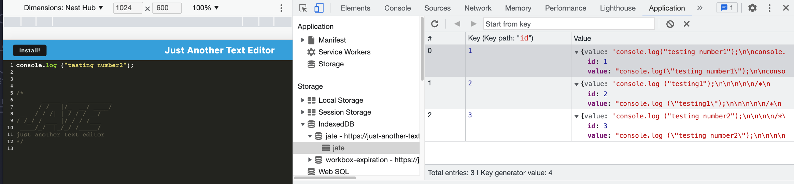

# Just-Another-TextEditor

  ## Description:
  The intention of this project is to create an text-editor web application that getting and storing datat to an IndexedDB database. It features npm package called `idb`, to store and retreive data from IndexedDB database. 

  ## Table of Contents

  * [Installation](#installation)
  * [Usage](#usage)
  * [Contribution](#contribution)
  * [Test](#test)
  * [Websites](#websites)
  * [License](#license)
  * [Questions](#questions)

  ## Usage
  This app is deployed via Heroku: https://just-another-texteditor.herokuapp.com/
  
    ### MOCK-UP
    The following image shows the application's IndexedDB storage:
    

    ### Technology
    * Node.js
    * Express.js
    * NPM Packages:
    * npm i idb
    * npm i if-env

  ## Contribution
  https://github.com/the-Coding-Boot-Camp-at-UT/UTA-VIRT-FSF-FT-12-2022-U-LOLC 
  https://www.npmjs.com/package/idb 
  https://web.dev/codelab-make-installable/ 

  ## Test
  N/A

  ## Websites
  Deployed: https://just-another-texteditor.herokuapp.com/
  GitHub: https://github.com/mjtic/text-editor

  ## License
  This project is under MIT License, for more information please refer to the license badge on top of this README
 
  ## Questions
  If you have additional questions please contact me at mjtic@email.com, or if you want to see more of my work you can find them at https://github.com/mjtic 
  